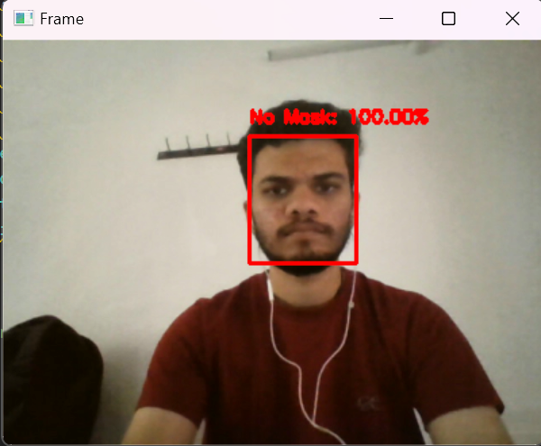

# COVID-19 Face Mask Detection

## Project Description

The Face Mask Detection project is designed to detect whether a person is wearing a face mask or not in real-time through a webcam feed. This project uses deep learning techniques to train a model that can accurately identify the presence of face masks in images and videos. This system can be particularly useful in ensuring compliance with health and safety protocols during the COVID-19 pandemic in public places like airports, shopping malls, and workplaces.

## Libraries Used

### TensorFlow and Keras
- **TensorFlow**: An end-to-end open-source platform for machine learning. Used here for building and training the deep learning model.
- **Keras**: A high-level neural networks API, written in Python and capable of running on top of TensorFlow. Used for designing the model architecture.

### Image Processing and Data Handling
- **opencv-python**: A library of programming functions mainly aimed at real-time computer vision. Used for capturing video frames and preprocessing images.
- **imutils**: A series of convenience functions to make basic image processing functions such as translation, rotation, resizing, skeletonization, and displaying Matplotlib images easier with OpenCV and Python.
- **numpy**: A fundamental package for scientific computing with Python. Used for handling array operations.
- **matplotlib**: A plotting library for the Python programming language and its numerical mathematics extension NumPy. Used for visualizing training history.

### Data Augmentation
- **tensorflow.keras.preprocessing.image.ImageDataGenerator**: A Keras utility that provides real-time data augmentation for training the model.

### Model and Performance Metrics
- **scikit-learn**: A machine learning library for Python. Used for label binarization, splitting the dataset, and generating classification reports.

## How It Works

1. **Data Loading and Preprocessing**:
   - The project begins by loading images from the dataset, which are divided into two categories: `with_mask` and `without_mask`.
   - Images are resized to a uniform size and preprocessed for the MobileNetV2 model.

2. **Data Augmentation**:
   - To improve the model's generalization capability, various image augmentation techniques like random flipping, brightness adjustment, contrast adjustment, saturation adjustment, and hue adjustment are applied.

3. **Model Architecture**:
   - The base model used is MobileNetV2, a lightweight deep learning model pre-trained on the ImageNet dataset.
   - Additional layers (average pooling, flatten, dense, and dropout layers) are added to fine-tune the model for the specific task of mask detection.

4. **Training**:
   - The model is trained using the augmented dataset for 20 epochs with a batch size of 32.
   - The Adam optimizer is used with a learning rate of 1e-4.

5. **Evaluation**:
   - The trained model is evaluated on a test set, and its performance is measured using metrics such as accuracy, precision, recall, and F1-score.

6. **Real-Time Mask Detection**:
   - A pre-trained face detector model is used to detect faces in video frames captured from a webcam.
   - Detected faces are passed through the trained mask detection model to predict whether each face is wearing a mask or not.
   - The results are displayed on the video feed with bounding boxes and labels indicating "Mask" or "No Mask".

## Usage

1. **Model Training**:
   - Ensure the dataset is organized properly with `with_mask` and `without_mask` subdirectories.
   - Run the provided Python script to load, preprocess, augment, and train the model.
   - The trained model is saved as `mask_detector.h5`.

2. **Real-Time Detection**:
   - Load the face detector model and the trained mask detector model.
   - Initialize the webcam feed and continuously capture video frames.
   - Detect faces and predict mask presence in each frame.
   - Display the results with bounding boxes and labels on the video feed.

## Output

## Applications

- **Public Health Safety**: Enforcing mask-wearing in public areas to reduce the spread of COVID-19.
- **Workplace Compliance**: Monitoring employees to ensure adherence to mask-wearing policies.
- **Access Control**: Integrating with security systems to allow or deny entry based on mask compliance.

This project demonstrates the practical application of machine learning & deep learning in enhancing public safety measures during the COVID-19 pandemic.
